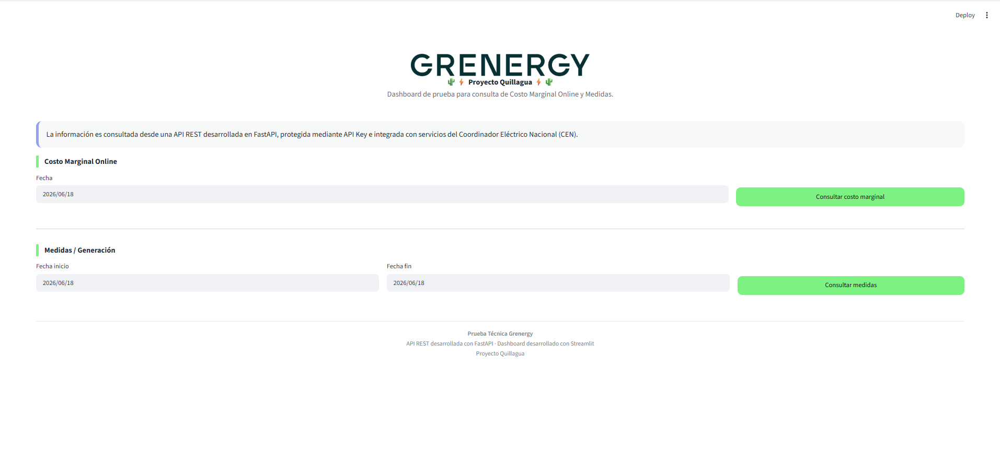
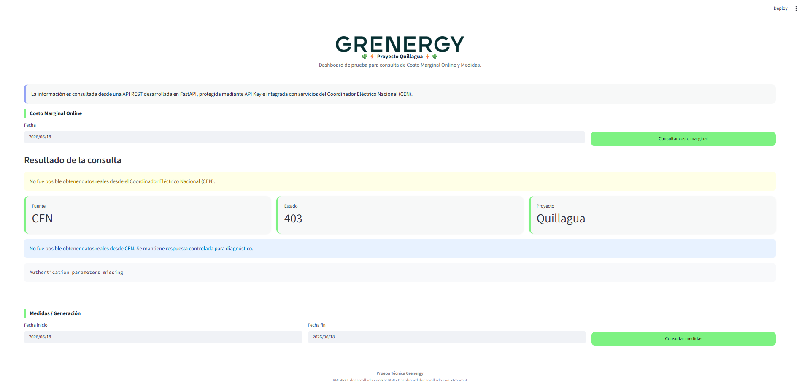

# Prueba Técnica – Grenergy

Este proyecto fue desarrollado como parte de una prueba técnica para el cargo IT Specialist en Grenergy. El objetivo es exponer información del proyecto Quillagua a través de una API REST y visualizarla en un dashboard web.

Esto incluye:
- API REST con FastAPI
- Autenticación por API Key
- Configuración por variables de entorno
- Integración con el Coordinador Eléctrico Nacional (CEN)
- Dashboard con Streamlit
- Manejo controlado de errores
- Despliegue en la nube con Render y Streamlit Cloud


## 🚀 Links de acceso rápido
- **API REST:** https://grenergy-api-test.onrender.com/health
- **Swagger:** https://grenergy-api-test.onrender.com/docs
- **Dashboard:** https://grenergy-api-test-wlu8jbkerapppsyadnepaih.streamlit.app/

## Arquitectura

```text
Dashboard (Streamlit)
        │
        ▼
API REST (FastAPI)
        │
        ▼
Autenticación (API Key)
        │
        ▼
Cliente de Integración CEN
        │
        ▼
Servicios Externos del Coordinador Eléctrico Nacional
```

## Estructura del proyecto
```text
grenergy-api-test
│
├── .devcontainer
│
├── backend
│   ├── auth.py
│   ├── cen_client.py
│   ├── config.py
│   ├── main.py
│   └── requirements.txt
│
├── dashboard
│   ├── app.py
│   └── assets
│       └── grenergy_logo.png
│
├── docs
│   ├── dashboard-1.png
│   └── dashboard-2.png
│
├── .gitignore
└── README.md
```

## Endpoints disponibles
GET /health — Estado de la API - Útil para verificar que el servicio está corriendo.
```json
{
  "status": "ok"
}
```

GET /costo-marginal — Costo Marginal
Parámetro: fecha
Tipo: string
Descripción: Fecha de consulta
GET /costo-marginal?fecha=2026-06-18

GET /medidas — Medidas / Generación
Parámetro -> fecha_inicio -> Tipo string -> Fecha Inicial
Parámetro -> fecha_fin -> Tipo string -> Fecha final
GET /medidas?fecha_inicio=2026-06-01&fecha_fin=2026-06-18

## 🔐 Autenticación
Los endpoints de negocio requieren una API Key en el header de cada solicitud:
X-API-Key: <api-key>

## Instalación y ejecución local
1. Crear y activar el entorno virtual
```bash
python -m venv venv
```
Windows:
bashvenv\Scripts\activate
macOS:
bashsource venv/bin/activate

2. Instalar dependencias
Desde la carpeta backend:
pip install -r requirements.txt

3. Configurar variables de entorno
Crear un archivo .env dentro de la carpeta backend:
envMY_API_KEY=<tu-api-key>

CEN_API_KEY_SIPUB=tu-<api-key-cen>
CEN_API_KEY_MEDIDAS=<tu-api-key-cen>

4. Levantar el backend
bashuvicorn main:app --reload
Swagger local disponible en: http://127.0.0.1:8000/docs

5. Levantar el dashboard
Desde la raíz del proyecto:
bashstreamlit run dashboard/app.py
Dashboard local disponible en: http://localhost:8501

## Manejo de errores
La aplicacion implementa un manejo controlado de errores provinientes de servicios externos. Cuando la integación con CEN no responde correctamente, la API devuelve respuestas controladas para evitar fallas en backend y en el dashboard.
json{
  "source": "CEN",
  "status": 403,
  "error": "Authentication parameters missing"
}

## ⚠️ Observaciones sobre la integración con el CEN
La integración fue implementada siguiendo la documentación Swagger oficial del CEN. Sin embargo, durante las pruebas se encontró que todos los escenarios evaluados retornan consistentemente:
403 Authentication parameters missing
Para descartar errores propios, se realizaron pruebas exhaustivas:

- Consumo directo desde el backend FastAPI
- Solicitudes desde Swagger/OpenAPI
- Pruebas con curl
- Validación de parámetros según documentación oficial
- Verificación de headers HTTP
- Comparación entre entorno local y despliegue en Render
- Pruebas desde el dashboard consumiendo la API desplegada

Se concluyó que la integración sí se comunica correctamente con el servicio externo, pero al parecer existe un requisito de autenticación adicional que no está documentado o que requiere una configuración específica del proveedor.
Mientras tanto, la solución funciona con un manejo controlado de errores, a nivel de API y dashboard. Se encuentra lista para conectarse en cuanto se cuente con el mecanismo de autenticación correcto.

## Decisiones de diseño

- FastAPI por su simplicidad, rendimiento y documentación automática con OpenAPI.
- API Key para proteger los endpoints de accesos no autorizados.
- cen_client.py para aislar la lógica de integración con el CEN y facilitar el mantenimiento.
- Manejo controlado de errores para que fallas externas no afecten la disponibilidad de la API.
- Streamlit para un dashboard accesible sin necesidad de conocimientos técnicos.


## Dashboard
### Vista principal

### Consulta de información


## Tecnologías utilizadas:
- Python
- FastAPI
- Streamlit
- HTTPX
- Python
- Dotenv
- Uvicorn
- Git
- GitHub
- Render
- Streamlit Cloud